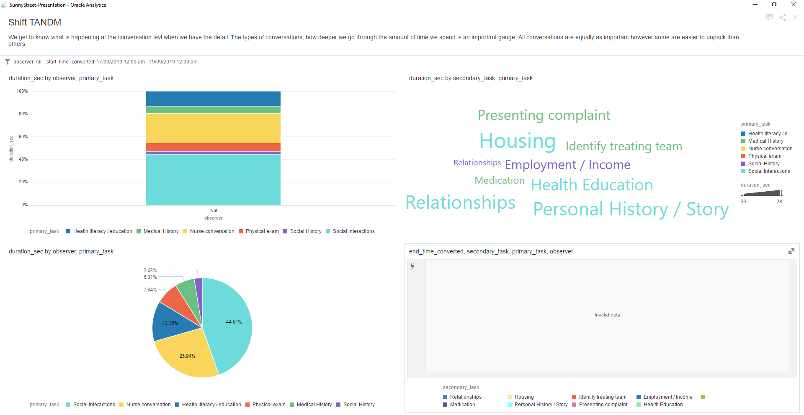

# My Pitch Deck for #VizForSocialGood

**Date: March 19** 
**Time: 1700 AEST (+10GMT)** 
**Sources:**
* Sunny Street (https://sunnystreet.org/)
* Cogniom (https://cogniom.com/)

**Collaborators:**
* Viz For Social Good (https://www.vizforsocialgood.com/)
* Frederic Fery (https://www.linkedin.com/in/frederic-fery/)

**Purpose: Present finding of the Datathon as per zoom** 

## Problem Statement 

> How might we help Sunny Street and their community to scale the number of conversations (whilst maintaining the value of the conversations)?

## Hypotheticals 

> *Why are there people being turned away?* 

 

> *Why are there increased numbers of people being turned away in Brisbane? And more so at the Wesley Mission?* 

 

## Assessments (Based Upon Data) 

> *When looking at a specific camp site shift, there was no captured data.* 

 

> *When looking at a different camp site shift, there is captured data but a smaller number of patients turned away.* 

 

## Experiments (Based Upon A Valued Conversations) 

> *We can see more about the conversations that are being had. Though we don't have a gauge of value or sentiment.* 

 

> *We can see the structure or unstructured nature of the conversations (and how it potentially impacts patients, staff and volunteers.* 

 

> *We can see the depth of conversation (in time) and explore how staff and volunteer numbers (including where and when).* 

 
